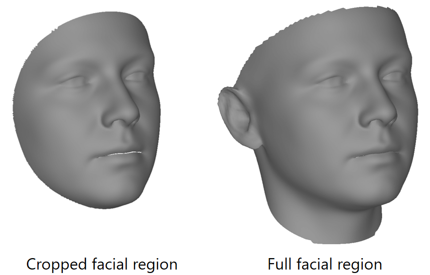

# Large Scale Facial Model (LSFM) Model Documentation

This file acts as documentation for the use of the Large Scale Facial Model (LSFM) presented in:

> [**A 3D Morphable Model learnt from 10,000 faces**
J. Booth, A. Roussos, S. Zafeiriou, A. Ponniah, D. Dunaway.
*Proceedings of IEEE Int’l Conf. on Computer Vision and Pattern Recognition (CVPR 2016). June 2016.*](http://ibug.doc.ic.ac.uk/media/uploads/documents/0002.pdf)

> **Large scale 3D Morphable Models**
J. Booth, A. Roussos, A. Ponniah, D. Dunaway, S. Zafeiriou.
*International Journal of Computer Vision (IJCV), under revision.*

### Acquiring LSFM

LSFM is made available to researchers for non-commercial use. For full terms and conditions, and to request access to the model, please visit the [LSFM website](http://ibug.doc.ic.ac.uk/resources/lsfm/).

Once you have LSFM, read this document and use the code provided in this repository to quickly get up and running.

## About the LSFM models

The LSFM models were produced by automatically placing the *MEin3D* facial mesh database into dense correspondence and taking PCA on subsets of the individuals in the dataset to form statistical models of the human face for different demographics. For details of the techniques employed, please see [the paper](http://ibug.doc.ic.ac.uk/media/uploads/documents/0002.pdf) - this document will highlight technical specifications of the models outputted.

We note that our technique involves an automatic pruning step to keep the model error-free, and additional pruning was performed in the publicly released models versus those shown in our CVPR paper.

#### Model Specifications

LSFM is actually a family of facial models built from the MEin3D facial mesh database.
As MEin3D contains demographic information for each subject, we are able to build models targeted for different demographic groups broken down by gender, ethnicity and age.

The full list of different demographic models, the size of the training set, and the number of components retained is given below.

Note that:
- The filename always takes the form `GENDER_ETHNICITY_AGE{_cropped}.mat`
 - Our most powerful, generic model, is therefore `all_all_all.mat`
- The number of components retained is always the minimal sufficient to retain 99.7% of the variance in the model's training set
- Among all possible combinations of age, gender and ethnicity, we retain only those ones for which sufficient training data exists in our database to build a useful model


| Filename                          | Gender | Ethnicity | Age         | Facial Region | Training Samples | No. Components (99.7% variance)
|-----------------------------------|--------|-----------|-------------|----------|-------- |-------- |-------- |
| `all_all_18-50.mat`               | All    | All       | 18 to 50    | Full    | 5106 | 183 |
| `all_all_18-50_cropped.mat`       | All    | All       | 18 to 50    | Cropped | 5106 | 280 |
| `all_all_7-18.mat`                | All    | All       | 7 to 18     | Full    | 2029 | 132 |
| `all_all_7-18_cropped.mat`        | All    | All       | 7 to 18     | Cropped | 2029 | 194 |
| `all_all_all.mat`                 | All    | All       | All         | Full    | 8402 | 158 |
| `all_all_all_cropped.mat`         | All    | All       | All         | Cropped | 8402 | 247 |
| `all_all_over50.mat`              | All    | All       | Over 50     | Full    | 446  | 176 |
| `all_all_over50_cropped.mat`      | All    | All       | Over 50     | Cropped | 446  | 224 |
| `all_all_under7.mat`              | All    | All       | 7 and under | Full    | 493  | 110 |
| `all_all_under7_cropped.mat`      | All    | All       | 7 and under | Cropped | 493  | 146 |
| `all_black_all.mat`               | All    | Black     | All         | Full    | 178  | 89  |
| `all_black_all_cropped.mat`       | All    | Black     | All         | Cropped | 178  | 106 |
| `all_chinese_all.mat`             | All    | Chinese   | All         | Full    | 137  | 75  |
| `all_chinese_all_cropped.mat`     | All    | Chinese   | All         | Cropped | 137  | 86  |
| `all_white_18-50.mat`             | All    | White     | 18 to 50    | Full    | 4412 | 186 |
| `all_white_18-50_cropped.mat`     | All    | White     | 18 to 50    | Cropped | 4412 | 284 |
| `all_white_7-18.mat`              | All    | White     | 7 to 18     | Full    | 1923 | 134 |
| `all_white_7-18_cropped.mat`      | All    | White     | 7 to 18     | Cropped | 1923 | 195 |
| `all_white_all.mat`               | All    | White     | All         | Full    | 7138 | 160 |
| `all_white_all_cropped.mat`       | All    | White     | All         | Cropped | 7138 | 251 |
| `all_white_over50.mat`            | All    | White     | Over 50     | Full    | 416  | 171 |
| `all_white_over50_cropped.mat`    | All    | White     | Over 50     | Cropped | 416  | 215 |
| `all_white_under7.mat`            | All    | White     | 7 and under | Full    | 387  | 104 |
| `all_white_under7_cropped.mat`    | All    | White     | 7 and under | Cropped | 387  | 135 |
| `female_all_18-50.mat`            | Female | All       | 18 to 50    | Full    | 2769 | 170 |
| `female_all_18-50_cropped.mat`    | Female | All       | 18 to 50    | Cropped | 2769 | 254 |
| `female_all_7-18.mat`             | Female | All       | 7 to 18     | Full    | 973  | 125 |
| `female_all_7-18_cropped.mat`     | Female | All       | 7 to 18     | Cropped | 973  | 177 |
| `female_all_all.mat`              | Female | All       | All         | Full    | 4430 | 154 |
| `female_all_all_cropped.mat`      | Female | All       | All         | Cropped | 4430 | 235 |
| `female_all_over50.mat`           | Female | All       | Over 50     | Full    | 251  | 130 |
| `female_all_over50_cropped.mat`   | Female | All       | Over 50     | Cropped | 251  | 156 |
| `female_all_under7.mat`           | Female | All       | 7 and under | Full    | 226  | 87  |
| `female_all_under7_cropped.mat`   | Female | All       | 7 and under | Cropped | 226  | 106 |
| `female_black_all.mat`            | Female | Black     | All         | Full    | 102  | 66  |
| `female_black_all_cropped.mat`    | Female | Black     | All         | Cropped | 102  | 74  |
| `female_chinese_all.mat`          | Female | Chinese   | All         | Full    | 88   | 59  |
| `female_chinese_all_cropped.mat`  | Female | Chinese   | All         | Cropped | 88   | 66  |
| `female_white_18-50.mat`          | Female | White     | 18 to 50    | Full    | 2424 | 173 |
| `female_white_18-50_cropped.mat`  | Female | White     | 18 to 50    | Cropped | 2424 | 258 |
| `female_white_7-18.mat`           | Female | White     | 7 to 18     | Full    | 930  | 126 |
| `female_white_7-18_cropped.mat`   | Female | White     | 7 to 18     | Cropped | 930  | 178 |
| `female_white_all.mat`            | Female | White     | All         | Full    | 3767 | 157 |
| `female_white_all_cropped.mat`    | Female | White     | All         | Cropped | 3767 | 241 |
| `female_white_over50.mat`         | Female | White     | Over 50     | Full    | 230  | 124 |
| `female_white_over50_cropped.mat` | Female | White     | Over 50     | Cropped | 230  | 147 |
| `female_white_under7.mat`         | Female | White     | 7 and under | Full    | 183  | 80  |
| `female_white_under7_cropped.mat` | Female | White     | 7 and under | Cropped | 183  | 97  |
| `male_all_18-50.mat`              | Male   | All       | 18 to 50    | Full    | 2337 | 188 |
| `male_all_18-50_cropped.mat`      | Male   | All       | 18 to 50    | Cropped | 2337 | 292 |
| `male_all_7-18.mat`               | Male   | All       | 7 to 18     | Full    | 1056 | 124 |
| `male_all_7-18_cropped.mat`       | Male   | All       | 7 to 18     | Cropped | 1056 | 176 |
| `male_all_all.mat`                | Male   | All       | All         | Full    | 3972 | 155 |
| `male_all_all_cropped.mat`        | Male   | All       | All         | Cropped | 3972 | 246 |
| `male_all_over50.mat`             | Male   | All       | Over 50     | Full    | 195  | 120 |
| `male_all_over50_cropped.mat`     | Male   | All       | Over 50     | Cropped | 195  | 140 |
| `male_all_under7.mat`             | Male   | All       | 7 and under | Full    | 267  | 94  |
| `male_all_under7_cropped.mat`     | Male   | All       | 7 and under | Cropped | 267  | 118 |
| `male_black_all.mat`              | Male   | Black     | All         | Full    | 76   | 53  |
| `male_black_all_cropped.mat`      | Male   | Black     | All         | Cropped | 76   | 59  |
| `male_chinese_all.mat`            | Male   | Chinese   | All         | Full    | 49   | 38  |
| `male_chinese_all_cropped.mat`    | Male   | Chinese   | All         | Cropped | 49   | 41  |
| `male_white_18-50.mat`            | Male   | White     | 18 to 50    | Full    | 1988 | 189 |
| `male_white_18-50_cropped.mat`    | Male   | White     | 18 to 50    | Cropped | 1988 | 292 |
| `male_white_7-18.mat`             | Male   | White     | 7 to 18     | Full    | 993  | 124 |
| `male_white_7-18_cropped.mat`     | Male   | White     | 7 to 18     | Cropped | 993  | 177 |
| `male_white_all.mat`              | Male   | White     | All         | Full    | 3371 | 154 |
| `male_white_all_cropped.mat`      | Male   | White     | All         | Cropped | 3371 | 245 |
| `male_white_over50.mat`           | Male   | White     | Over 50     | Full    | 186  | 116 |
| `male_white_over50_cropped.mat`   | Male   | White     | Over 50     | Cropped | 186  | 135 |
| `male_white_under7.mat`           | Male   | White     | 7 and under | Full    | 204  | 85  |
| `male_white_under7_cropped.mat`   | Male   | White     | 7 and under | Cropped | 204  | 104 |


#### Cropped and full head model

We note that for each of the above demographic groups we provide a full and cropped face model. Due to deficiencies in the underlying MEin3D dataset, the edges of the full face models lack statistical detail, although they do capture global variation in face shape well.

We have found that for some applications, having the full face model is important in providing boundary constraints.
In other applications, the lack of statistical diversity in the edge of the face may be problematic, or the input data may be incomplete.
In such cases we recommend the use of the cropped model variant.

The reigons covered by the full and cropped variants are shown here:



Details of the topology of the two model variants is given below:

| Facial Region | No. Vertices | No. Triangles |
|---------------|--------------|---------------|
| Full          |  53215       | 105840        |
| Cropped       |  28431       | 56272         |

The vertices of the cropped model are a subset of the full model, and the mapping between the two is provided (see below).

#### Model Format

Each of the above LSFM models is provided in a Matlab `.mat` file that can be easily imported into Python:
```py
from scipy.io import loadmat
loadmat(‘./lsfm_file.mat’)
```
Or matlab:
```matlab
load(‘./lsfm_file.mat’)
```
Each `.mat` model file contains the following:

| Key  | Datatype | Interpretation |
|------|----------|----------------|
|`mean`| Floating point array of shape `(n_vertices * 3,)` | The mean of the model, ordered as `[x_1, y_1, z_1, ..., x_n, y_n, z_n]`.
|`components`| Floating point matrix of shape `(n_vertices * 3, n_components)` | The unit eigenvectors that make up the statistical model. Each component ordered as the mean is.
|`eigenvalues`| Floating point array of shape `(n_components,)` | The corresponding eigenvalue (variance) for each component
|`cumulative_explained_variance`| Floating point array of shape `(n_components,)` | The cumulative variance explained by retaining all components up to this one. Final value will always be just above `0.997`.
|`trilist`| Integer matrix of shape `(n_triangles, 3)` | The `0`-based triangulation of the vertices needed to form the mesh surface.
|`n_training_samples`| Integer | The number of facial scans used to build the model.

Cropped facial models (those ending in `_croped.mat`) have an additional two fields, describing the mapping between the full and cropped facial models:

| Key  | Datatype | Interpretation |
|------|----------|----------------|
|`map_cropped_to_full`| Integer array of shape `(n_cropped_vertices,)` | `i`'th value encodes the matching vertex index in the full model for the `i`'th vertex of the cropped model
|`map_full_to_cropped`| Integer array of shape `(n_full_vertices,)` | `j`'th value encodes the matching vertex index in the cropped model for the `j`'th vertex of the full model. Where no mapping exists, `-1` is set.


## Loading LSFM models with Menpo

As of `menpo3d ` v0.5.2 an importer for the LSFM file format is included:

```python
import menpo3d.io as m3io

model = m3io.import_lsfm_model('./path/to/all_all_all.mat')
print(model)
```

This returns a Menpo [`PCAModel`](https://menpo.readthedocs.io/en/stable/api/model/PCAModel.html), ready for use.
